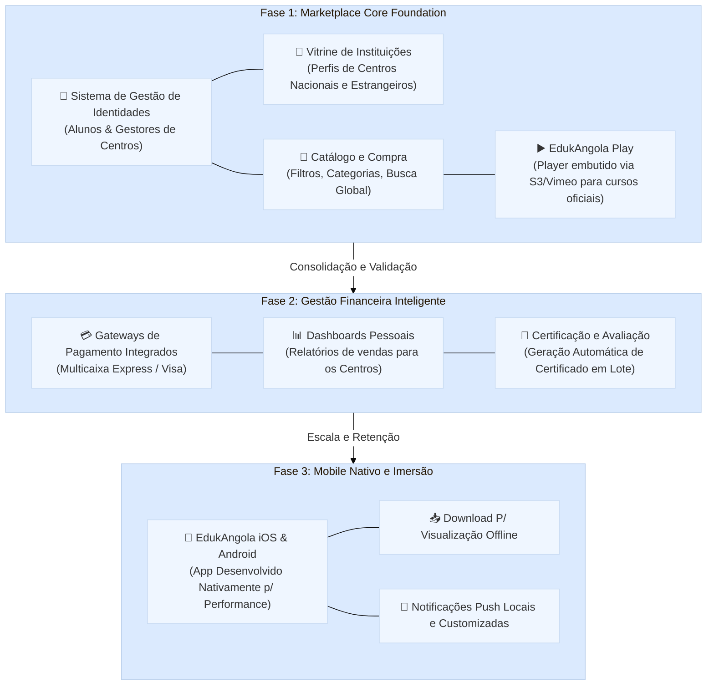

# 🚀 EdukAngola: Visão e Evolução do Produto

Este documento foi criado para apresentar estruturalmente as etapas de evolução do Marketplace Educacional "EdukAngola". Desenhamos a arquitetura do projeto de forma gradual, garantindo sustentabilidade técnica e alinhamento com as reais necessidades do mercado antes da escala global e do lançamento Mobile.

---

## 🎨 O Conceito Base (Minimum Viable Product)
Em vez de começar com um "monstro" técnico que gerencia complexos fatores de ERP para as escolas, recuamos um passo e focamos numa experiência primária e de altíssima qualidade:
**Um Marketplace Elegante, Responsivo e Centralizado em Cursos.**

*   **Público:** Centros de formação (Nacionais e Estrangeiros) publicando cursos.
*   **Alunos:** Explorando o catálogo global, comprando vagas e consumindo via EdukAngola Play.

---

## 🗺️ Roadmap de Evolução por Fases

Abaixo ilustramos como passaremos de um sistema Web primário para uma Plataforma Multicanal Inteligente.

---

## 🛠️ Decisões Tecnológicas por Etapa

### Fase 1: Fundação Sólida (Web responsiva)
- **O que fazemos:** Aproveitamos e adaptamos o Template Atual (HTML/CSS), convertendo em um marketplace 100% focado no Core, sem PWA ou "gambiarras" móveis.
- **Backend Central:** Django 5.x será o cérebro que fornece as listagens, autenticação segura e a regra de negócio inicial estruturada (APIs e páginas focadas no carregamento leve).
- **Conteúdo de Vídeo:** Usar serviços de terceiros (como YouTube Não Listado inicial ou Vimeo Pro) para baratear custos e não colocar em risco a disponibilidade do nosso site princípal.

> [!TIP]
> **Foco Exclusivo no Crescimento:** Fazer a Fundação Web ser perfeita cria tráfego orgânico no Google (SEO), algo que não conseguiríamos focando e aprisionando o produto rapidamente num "App Mobile" que os usuários teriam inércia para baixar no primeiro dia.

### Fase 2: Automatização e Retenção
Com utilizadores e fluxo financeiro estabelecido, os desenvolvedores conectarão serviços de filas assimétricas (`Celery + Redis`). É agora que enviaremos milhares de e-mails, processaremos dezenas de certificados automáticos via PDFs rigorosos sem encravar o servidor e conectaremos a API do Multicaixa Express.

### Fase 3: O Verdadeiro Mobile Nativo
Finalmente, tendo as APIs do Django consolidadas na Fase 2, uma equipa focada irá consumir nossa plataforma para criar as versões Nativas do aplicativo utilizando tecnologias propícias para a máxima performance (Ex: React Native, Flutter ou Kotlin/Swift). O foco do Mobile não é "mostrar o site", é **retenção, notificações no ecrã e visualização offline**.

---
*Este documento é a "Bússola Norteadora" e garante que o orçamento técnico seja gasto no módulo correto, na hora exata.*
